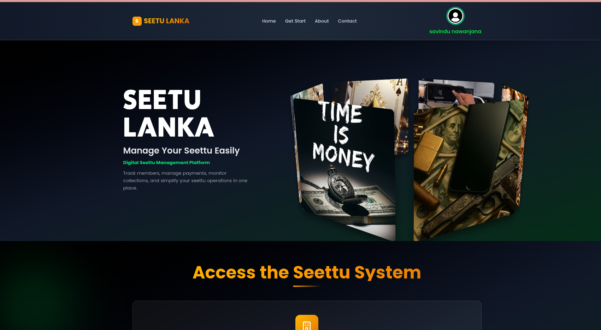

Seettu Application System – Project Description

1. Introduction

This system is a modern financial management application developed by integrating the traditional Sri Lankan “Seettu” (Cheetu) savings and loan system with digital technology.

The main objective of this application is to reduce issues such as manual record keeping, payment tracking errors, member management difficulties, and lack of transparency found in the traditional Seettu system.

2. About the Seettu System

The Seettu system is:

A group savings system
A rotating credit system
An informal community-based financial system

In this system, a group of members contribute a fixed amount of money at regular intervals (monthly or weekly). The total collected amount is then given to one member at a time in a rotating order until the cycle is completed.

3. Core Concept

The Seettu system is known as a “Rotating Credit Association.”

Example:

5 members participate
Each member contributes Rs. 5000

Then:

Total monthly collection = Rs. 25,000
One member receives the full amount per turn
The process continues until all members receive their turn
4. Social Importance

The Seettu system plays an important role in community finance by:

Increasing trust among members
Strengthening community relationships
Providing mutual financial support
Enhancing social cohesion

Because of these benefits, it has become popular in both rural and urban areas of Sri Lanka.

5. Types of Seettu System

5.1 Drawing Lots Seettu

In this method, the winner is selected through a lottery (drawing lots).

5.2 Auction Seettu

(Font Size: 16 – Bold)
In this method, the member who wishes to receive the money earlier is selected through a bidding or auction process.

6. Features of the Seettu Application

Member registration
Seettu group creation
Monthly/weekly payment management
Payment history tracking
Installment tracking
Due payment notifications
Winner selection management
Financial report generation
7. System Advantages

Reduces manual errors
Minimizes data loss
Improves transparency
Reduces fraud risk
Ensures accurate and fast calculations
8. User Roles

8.1 Administrator

Manage members
Monitor payments
Generate reports
Control Seettu groups
8.2 Members

View payment status
Check due payments
Track Seettu progress
9. Conclusion

The Seettu Application System modernizes the traditional Sri Lankan Seettu savings method by transforming it into a digital platform.

It combines community-based financial culture with modern technology to provide a secure, efficient, and reliable financial management solution.

 frount-end=https://smart-seettu-web-fe.vercel.app/

